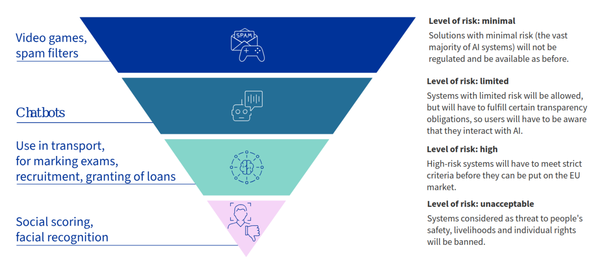

# Fairness, Accountability, Transparency and Ethics in Machine Learning.

### Introduction to Computational Modelling. Degree in Computer Engineering. University of Cordoba. 2025-2026

Javier Sánchez Monedero (Universidad de Córdoba)

--- 

# Objectives

- Introduction and motivation to FATE in artificial intelligence

- Quantifying and mitigating bias: [FairLearn](https://fairlearn.org/)

---
<!-- _backgroundColor: "#123" -->
<!-- _color: "#fff" -->
##### <!--fit--> Introduction and motivation to FATE
--- 

# Where to start? Books

  

<!--
--- 

# ¿Por dónde empezar? Libros

   
-->
--- 

# Where to start? Video

- Documentary [Coded Bias](https://www.codedbias.com/)
- TED Talk dy Joy Buolamwini [How I'm fighting bias in algorithms](https://www.ted.com/talks/joy_buolamwini_how_i_m_fighting_bias_in_algorithms)

---
# FATE

- **Fairness**
- **Accountability**
- **Transparency**
- **Ethics**

[facctconference.org](https://facctconference.org/)
[facctconference.org/network](https://facctconference.org/network/)

---
# Seminar objectives

Discrimination in **systems/models** that make/support decisions with human consecuences.

- This does not consider other forms of discrimination or injustice.

- Discrimination/equality issues need other kinds of non-technical interventions (see recommended books)

**Discrimination is not a general concept**, it depends: 

- Domain of the problem

- Social group

---
# Protected Groups

Protected classes (not in all contexts): 

- USA: "race", colour, gender, religion, religion, citizenship, pregnancy, age....

- Spain: gender, pregnancy, "race" (equal treatment law)...

The definition of protected groups goes further and includes the following categories [non-binary](https://www.genderbread.org/) and [intersectionality](https://en.wikipedia.org/wiki/Intersectionality)

> [There’s No Scientific Basis for Race—It’s a Made-Up Label](https://www.nationalgeographic.com/magazine/2018/04/race-genetics-science-africa). National Geographic. 2018, March 12. 

<!--
Con el "pero" de lo difícil de expresar la pertenencia a grupo, es interesante [intersectionalityscore.com](https://intersectionalityscore.com/)

-->

---
# Law on equal treatment and non-discrimination

[Artículo 23 Ley 15/2022, de 12 de julio](https://www.boe.es/buscar/doc.php?id=BOE-A-2022-11589): 

---
# Risk based approach of AI Act

> Source [Artificial intelligence act](https://www.consilium.europa.eu/en/policies/artificial-intelligence/)

---
# ...but people also have biases

 

Differences (O'Neil 2016): 

* Systematisation

* Scale

* New "digital" groups discriminated against

> O’Neil, C (2018). [Weapons of Math Destruction](https://en.wikipedia.org/wiki/Weapons_of_Math_Destruction)

---
# Cases: NLP + Computer Vision

> Zhao, J. et. al (2017). [Men Also Like Shopping: Reducing Gender Bias Amplification using Corpus-level Constraints.](https://www.aclweb.org/anthology/D17-1319) 

---
# Case: facial recognition

Intersectional analysis of Amazon Rekognition face recognition performance. The lowest hit rate is for dark-skinned women. 

> Fuente Buolamwini (2019). [Response: Racial and Gender bias in Amazon Rekognition — Commercial AI System for Analyzing Faces.](https://medium.com/@Joy.Buolamwini/response-racial-and-gender-bias-in-amazon-rekognition-commercial-ai-system-for-analyzing-faces-a289222eeced)

---
# Case: justice

* **COMPAS** (*Correctional Offender Management Profiling for Alternative Sanctions*): tool for calculating recidivism risk scores for a person awaiting trial
* Uses ML to train a **risk estimation model from historical records**.
* **Input variables**: criminal history, type of charges, gender, ethnicity, age, environmental questions...
* **Dependent variable**: degree of risk, high degrees go to pre-trial detention.

---
# Case: justice

> Angwin, J., & Larson, J. (2016, May 23). [Machine Bias](https://www.propublica.org/article/machine-bias-risk-assessments-in-criminal-sentencing). ProPublica. 

---
<!-- _backgroundColor: "darkgreen" -->
<!-- _color: "cornsilk" -->
# A1. How would you quantify bias in the above problems?

<!-- Penitenciario: "Predicción" riesgo de reincidencia: el sistema sobreestima el riesgo para afroamericanos en comparación con población blanca-->
* **Facial recognition**: the model is less accurate in identifying women with dark skin.

* **Justice**: the model overestimates the risk of recidivism for African-Americans

* **Natural language processing**: system reproduces gender stereotypes associated with professions

---
<!-- _backgroundColor: "#123" -->
<!-- _color: "#fff" -->
##### <!--fit--> Quantifying and mitigating bias

---
# How to measure and mitigate bias?

~~Fairness through *unawareness*~~

Updated from [NIPS 2017 Tutorial on Fairness in Machine Learning](https://fairmlbook.org/tutorial1.html)

---
# Exploratory analysis

- Check distribution (prevalence/prior) class label
- Check distribution (prevalence/priority) class label by groups
- Check: 
  - Visual
  - Descriptive statistics
  - Hypothesis testing

An excellent example can be found in Straw, I., & Wu, H. (2022).

> Straw, I., & Wu, H. (2022). Investigating for bias in healthcare algorithms: A sex-stratified analysis of supervised machine learning models in liver disease prediction. BMJ Health & Care Informatics, 29(1), e100457. https://doi.org/10.1136/bmjhci-2021-100457

<!--
# Definición formal
-->

--- 
# The "zoo" of fairness metrics

> Castelnovo, A., Crupi, R., Greco, G. et al. A clarification of the nuances in the fairness metrics landscape. Sci Rep 12, 4209 (2022). https://doi.org/10.1038/s41598-022-07939-1

---
<!-- _backgroundColor: "darkgreen" -->
<!-- _color: "cornsilk" -->
# A3. Judicial case

* Suppose a generic test (with or without statistical techniques) to estimate the risk of recidivism. What errors should we minimise?
* Regarding the class: what metrics are we interested in?
* What if the test involves loss of freedom?

---
# Cases: COMPAS

* **ProPublica**: the system discriminates because it overestimates the risk for African Americans (different false positive for the groups: 44.8% vs 23.4%).
* **Northpointe**: system does not discriminate because it classifies high risk equally (similar true positives for all ethnic groups: 63% vs. 59%)

> Larson, J., & Angwin, J. (2016, May 23). [How We Analyzed the COMPAS Recidivism Algorithm](https://www.propublica.org/article/how-we-analyzed-the-compas-recidivism-algorithm). ProPublica. 

---
# Cases: COMPAS

How can ProPublica's and Northpointe's mathematical definitions of fairness be compatible?

> Source [Han Solo and Bayesian Priors](https://www.countbayesie.com/blog/2015/2/18/hans-solo-and-bayesian-priors)

---
# Cases: COMPAS

It is mathematically compatible because the a priori prevalence/baseline frequency/probability of the two groups is different (see Chouldechova (2017)).

> A. Chouldechova. Fair Prediction with Disparate Impact: A Study of Bias in Recidivism Prediction Instruments. Big Data, 5(2):153–163, 2017. https://doi.org/10.1089/big.2016.0047 
---
<!-- _backgroundColor: "darkgreen" -->
<!-- _color: "cornsilk" -->
# A4. How can we mitigate bias?

* We already have a measure of statistical bias.
* How could we mitigate?
* But first: **Does a statistical/algorithmic intervention make sense?**
 
---
# Bias mitigation techniques

> Fuente Ntoutsi, E., Fafalios, P., Gadiraju, U., Iosifidis, V., Nejdl, W., Vidal, M.-E., … Staab, S. (2020). Bias in data-driven artificial intelligence systems—An introductory survey. WIREs Data Mining and Knowledge Discovery, 10(3), e1356. https://doi.org/10.1002/widm.1356

  
<!-- ---
# Cases databases

[Automating Society Report 2020](https://automatingsociety.algorithmwatch.org/report2020/spain)

[Observatory of Algorithms with Social Impact](https://eticasfoundation.org/oasi) -->

---
# ML tools for mitigation and explainability

https://fairlearn.org/

Alternatives: 

https://ai-fairness-360.org/

https://pair-code.github.io/what-if-tool/

---
# Jupyter lab notebook with FairLearn and COMPAS

- COMPAS general recidivism data
- Simplified version of ProPublica experiments
  
https://github.com/javism/seminariofate2025

<!--
---
# Heurísticas para cuantificar el sesgo: 

> Fuente https://textbook.coleridgeinitiative.org/chap-bias.html#dealing-with-bias 

-->

---
<!-- _backgroundColor: "#123" -->
<!-- _color: "#fff" -->
##### <!--fit--> Summary and Conclusions

---
# Recap: bias sources

> Source Luke Vilain.

---
# Summary

* The move from research prototypes to real applications of artificial intelligence has led to the emergence of many research lines
* Not only FATE: Robust AI, privacy in AI (federated learning, homeomorphic encryption...), human-machine interaction (HCI)...
* Areas involved according to context: ethics, law, politics ->  **Socio-technical systems!**
* Regulation (IA Act, GDPR, Rider Act, AESIA...) and standards (IEEE, ISO)
* Learning opportunities and better understanding of statistical problems and concepts.

<!-- 
---
# Oportunidades de aprendizaje e investigación

* Revisitar problemas desde otros puntos de vista
* Mejorar entendimiento de la inteligencia artificial y la estadística
* Trabajar con equipos interdisciplinares y diversos
* Trabajar con colectivos
  
-->
---
# Trabajos relacionados de AYRNA

## Explorar límites de precisión vs ecuanimidad

Valdivia, A., Sánchez‐Monedero, J., & Casillas, J. (2021). How fair can we go in machine learning? Assessing the boundaries of accuracy and fairness. *Int J Intel Sys*, 36(4), 1619–1643. https://doi.org/10.1002/int.22354

## Gender-Equity model for Liver Allocation

El grupo AYRNA, IMIBIC y otros centros trabajan en alternativas al MELD que no discriminen por género como estimador de riesgo de mortalidad en trasplantes hepáticos. https://gema-transplant.com/

---
# Trabajos relacionados de AYRNA

## Desarrollo Ley Rider

Guía práctica y herramienta sobre la obligación empresarial de información sobre el uso de algoritmos en el ámbito laboral. *Ministerio de Trabajo y Economía Social. Gobierno de España*. 2022. https://prensa.mites.gob.es/WebPrensa/noticias/laboral/detalle/4125

## Proyecto AlgoRace

Proyecto AlgoRace. Investigación sobre discriminación racial e inteligencia artificial. 2021-2024. https://algorace.org/

---
# Referencias (I)

- O’Neil, C (2018). Armas de destrucción matemática. Capitán Swing. https://capitanswing.com/libros/armas-de-destruccion-matematica/

- Catherine D'Ignazio and Lauren F. Klein (2020). Data Feminism. MIT Press. https://mitpress.mit.edu/9780262044004/

- Solon Barocas and Moritz Hardt and Arvind Narayanan (2019). *Fairness and Machine Learning: Limitations and Opportunities*. http://www.fairmlbook.org

- Moritz Hardt (2020). *Fairness and Machine Learning* ([Part 1](https://www.youtube.com/watch?v=Igq_S_7IfOU), [Part 2](https://www.youtube.com/watch?v=9oNVFQ9llPc)) (MLSS 2020)

- Zhao, J. et. al (2017). Men Also Like Shopping: Reducing Gender Bias Amplification using Corpus-level Constraints. https://www.aclweb.org/anthology/D17-1319

- Buolamwini (2019). [Response: Racial and Gender bias in Amazon Rekognition — Commercial AI System for Analyzing Faces.](https://medium.com/@Joy.Buolamwini/response-racial-and-gender-bias-in-amazon-rekognition-commercial-ai-system-for-analyzing-faces-a289222eeced)
  
---
# Referencias (II)

- Verna, E. C., & Lai, J. C. (2020). Time for Action to Address the Persistent Sex-Based Disparity in Liver Transplant Access. JAMA Surgery, 155(7), 545–547.https://doi.org10.1001/jamasurg.2020.1126

- Straw, I., & Wu, H. (2022). Investigating for bias in healthcare algorithms: A sex-stratified analysis of supervised machine learning models in liver disease prediction. BMJ Health & Care Informatics, 29(1), e100457. https://doi.org/10.1136/bmjhci-2021-100457

- Castelnovo, A., Crupi, R., Greco, G. et al. A clarification of the nuances in the fairness metrics landscape. Sci Rep 12, 4209 (2022). https://doi.org/10.1038/s41598-022-07939-1

- Ntoutsi, E., Fafalios, P., Gadiraju, U., Iosifidis, V., Nejdl, W., Vidal, M.-E., … Staab, S. (2020). Bias in data-driven artificial intelligence systems—An introductory survey. WIREs Data Mining and Knowledge Discovery, 10(3), e1356. https://doi.org/10.1002/widm.1356

- A. Valdivia, C. Hyde-Vaamonde, J. García-Marcos. Judging the algorithm: A case study on the risk assessment tool for gender-based violence implemented in the Basque country. https://arxiv.org/abs/2203.03723
